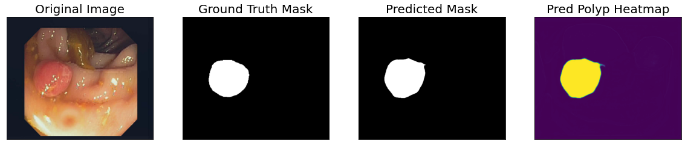

 

# Hi everyone! 
This is "the" moment I should introduce myself, about bachelor/master degrees, job experiences, github repositories etc. etc. However, I'm a Data Scientist! Let me introduce myself, using a linear regression:

 

$$UserProfile = Name \times X_{1} + BachelorDegree \times X_{2} + MasterDegree \times X_{3} + JobExperience \times X_{4} + GitHubRepositories \times X_{5} + URLs \times X_{6}$$

| Feature Name | Estimate          | Pr(>\|t\|) | Estimate |
|--------------|-------------------|------------|----------|
| Name         | Alberto Fernández | 2e-05      | *        |
| Bachelor degree | Computer Science - Universidad de Alcalá de Henares | 4e-05           | **         |
| Master degree | Big Data & Business Analytics - Universidad Complutense de Madrid | 4.5e-05           | **         |
| Job experience | Healthcare and Telco industry | 5e-05           | ***         |
| URLs |  | 5e-05           | ***         |

## Computer Vision - Portfolio projects

  * __[Knee lesions classification via deep learning techniques (using a transfer-learning model based on Stanford MRI Dataset)](https://github.com/AlbertoUAH/Knee-Lesions-Classification-via-Deep-Learning)__:  
    

     
    

    
  * __[Polyps segmentation on colonoscopy images via deep learning](https://github.com/AlbertoUAH/polyps-image-segmentation)__:

 

* __[GI Tract segmentation](https://github.com/AlbertoUAH/gi-tract-segmentation)__:

 

## NLP projects

* __[PodcastNER](https://github.com/sergiopperez/hackathon_podcast)__:

    

## NGO projects - [SoGoodData](https://sogooddata.org/)

* __[Identifying Spanish towns at risk of depopulation: a clustering approach with R (slides in Spanish)](https://docs.google.com/presentation/d/1Cqvhf0W5QFEXd0AXpiuPQrZzVGl67qf1/edit#slide=id.p20)__

## Competitions 

### [Pump it up: data mining the watertable - Driven data](https://www.drivendata.org/competitions/7/pump-it-up-data-mining-the-water-table/)

__Position__: 47 of 12508 (Username: Big Data - UCM)

[URL to RMarkdown code - RPubs](https://rpubs.com/Alberto98/891456) (comments in Spanish)

### [UW-Madison GI Tract Image Segmentation - Kaggle](https://www.kaggle.com/competitions/uw-madison-gi-tract-image-segmentation)

### [Finalist at SomosNLP Hackathon - "Los LLMs hablan español"](https://www.linkedin.com/feed/update/urn:li:activity:7056944509401636864/)
 
# 🛠 Tech skills 

<table class="center" style="margin: 0 auto;">
<tbody align="center">
 <tr>
   
<td align="center" width="25%">
<b>
Python
</b>  
 
</td>

   
<td align="center" width="30%">
<b>
OpenCV
</b>   
 
</td>

<td align="center" width="25%">
<b>
PyTorch
</b>  
 
</td>

<td align="center" width="25%">
<b>
Notebook
</b>   
 
</td>
</tr>

<tr> 
<td align="center" width="25%">
<b>
Sklearn
</b>  
 
</td>

<td align="center" width="25%">
<b>
NumPy
</b>  
 
</td>

<td align="center" width="25%">
<b>
Pandas
</b>  
 
</td>

<td align="center" width="25%">
<b>
Matplotlib
</b>  
                             
</td>

</tr>

<tr>
<td align="center" width="25%">
<b>
Tensorflow
</b>  

</td> 

<td align="center" width="25%">
<b>
Keras
</b>  
 
</td>

<td align="center" width="25%">
<b>
MySQL
</b>  

</td>

<td align="center" width="25%">
<b>
Linux
</b>  

</td>

</td>

</tr>
<tr>

<td align="center" width="25%">
<b>
Git
</b>  
 
</td>
    
<td align="center" width="25%">
<b>
Google Cloud
</b>  
 
</td>
    
<td align="center" width="25%">
<b>
Docker
</b>  
 
</td>
 
<td align="center" width="25%">
<b>
VS CODE
</b>  
 
</td>   
</tr>

</tbody>
</table>

__And the most important skill...__

Just kidding 🤣...

