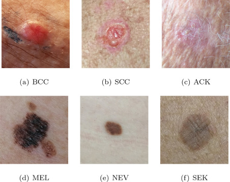

 

 
# Hi everyone! 
This is "the" moment I should introduce myself, about bachelor/master degrees, job experiences, github repositories etc. etc. However, I'm a Data Scientist! Let me introduce myself, using a linear regression:

__Alberto\_profile = Bachelor\_degree*X1 + Master\_degree*X2 + Job\_experience*X3 + GitHub\_repositories*X4__

* Where _Bachelor\_degree_ equals: __Computer Science at University of Alcalá de Henares (Spain)__
* Where _Master\_degree_ equals: __Big Data & Business Analytics at Complutense University of Madrid__
* Where _Job\_experience_ (as a Data Scientist) equals:
  * __Knee lesions classification via deep learning techniques (using a transfer-learning model based on Stanford MRI Dataset)__:  
    

     
    

  * __Skin lesions detection (benign and malignant) via deep learning techniques__:

 

 
