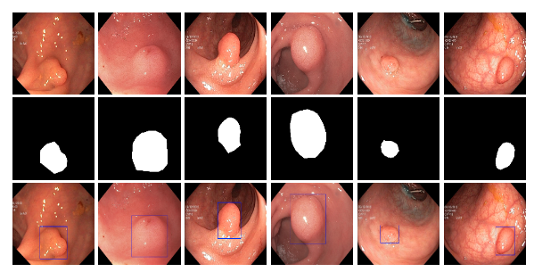

 

 
# Hi everyone! 
This is "the" moment I should introduce myself, about bachelor/master degrees, job experiences, github repositories etc. etc. However, I'm a Data Scientist! Let me introduce myself, using a linear regression:

__User\_profile = Name*X1 + Bachelor\_degree*X2 + Master\_degree*X3 + Job\_experience*X4 + GitHub\_repositories*X5__

* Where _Name_ equals: __Alberto Fernández Hernández__ 

* Where _Bachelor\_degree_ equals: __4 years - Computer Science at University of Alcalá de Henares (Spain)__ 

* Where _Master\_degree_ equals: __1 year - Big Data & Business Analytics at Complutense University of Madrid__ 

* Where _Job\_experience_ equals: __Data Scientist at the healthcare industry__ 

## Portfolio projects

  * __[Knee lesions classification via deep learning techniques (using a transfer-learning model based on Stanford MRI Dataset)](https://github.com/AlbertoUAH/Knee-Lesions-Classification-via-Deep-Learning)__:  
    

     
    

  * __[Polyps segmentation on colonoscopy images via UNet model (part I) (Coming soon...)](https://github.com/AlbertoUAH/polyps-image-segmentation)__:

 

 
# Data Science skills 

